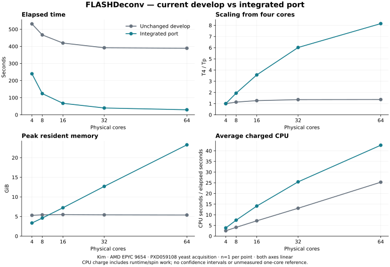

# FLASHDeconv: parallel execution on current develop

At 64 physical cores the port is **13.23× faster** (388.99 → 29.40 seconds), with peak RSS 5.375 → 23.266 GiB. All complete output files match. This is a fresh comparison of unchanged fork develop `0bee1589e6baa5fad030115804ba94c5ac2f52da` and the integrated port, using one measurement per cell. Historical FVdeploy timings are separate evidence.

## Results

| Physical cores | Develop wall (s) | Port wall (s) | Speedup | Peak RSS, develop / port (GiB) | CPU, develop / port (s) |
| ---: | ---: | ---: | ---: | ---: | ---: |
| 4 | 531.30 | 239.77 | 2.22× | 5.308 / 3.345 | 1336.50 / 919.81 |
| 8 | 467.01 | 123.99 | 3.77× | 5.418 / 4.606 | 1923.58 / 927.21 |
| 16 | 419.32 | 67.18 | 6.24× | 5.486 / 7.228 | 3010.61 / 947.01 |
| 32 | 391.81 | 39.82 | 9.84× | 5.415 / 12.676 | 5121.22 / 1013.25 |
| 64 | 388.99 | 29.40 | 13.23× | 5.375 / 23.266 | 9834.56 / 1252.78 |



Both axes are linear. From 4 to 64 physical cores, within-version scaling is **1.37×** for develop and **8.16×** for the port. There is no inferred one-core reference, repetition median or confidence interval. Average charged cores are user-plus-system CPU seconds divided by elapsed seconds; this includes runtime/kernel/spin work and is not productive-core occupancy.

The port increases concurrency by keeping several complete mutable spectra in flight. Dense bin arrays, candidate/scoring groups and reusable capacities remain per worker; the immutable shared model removes only read-only replication. This explains why lower copying does not guarantee lower whole-process peak RSS. The timing grid does not identify the dominant allocation, allocator retention, cache misses or memory bandwidth.

## Reproducing the comparison

Measured on 8 October 2026 on Kim, dual AMD EPYC 9654: 192 physical cores, 384 logical CPUs. The driver checked the live topology against the saved inventory before each run. Fixed placements use nested prefixes balanced across the two sockets, one logical CPU per physical core, with no SMT siblings. Pairs run serially, alternating which version runs first.

The complete centroided yeast input from [PXD059108, CE-MS Top Down Proteomics Multi-lab Study](https://proteomecentral.proteomexchange.org/cgi/GetDataset?ID=PXD059108) is [11112024_IntactYeastX0p166mg_3SecMS2_rep2_689.mzML](https://ftp.pride.ebi.ac.uk/pride/data/archive/2025/12/PXD059108/11112024_IntactYeastX0p166mg_3SecMS2_rep2_689.mzML), 1,246,429,459 bytes, SHA256 `4d5cb22bd51627ee613c2ee374d658b238aad7a08b0ff7916da3c01467f4ea09`. Its measured census is 13,185 spectra (2,019 MS1; 11,166 MS2), with 90,546,658 raw peak-array points. This is the largest input tested in this study, not the largest file in the accession.

Both fresh native builds use C++23, Release `-O3 -DNDEBUG`, OpenMP, shared Boost, and GUI/pyOpenMS disabled. Compiler: `x86_64-conda-linux-gnu-c++ (conda-forge gcc 14.4.0-4) 14.4.0`. The actual loaded closures have **158 identical external dependencies**; only explicitly bound OpenMS-family libraries may differ. Both builds omit build-directory RPATHs, while the compiler's common dependency-prefix RPATH remains. The driver checked actual resolved files rather than assuming the loader path.

Run the baseline and port with the same input and default algorithm parameters, including precursor window 1 and no spectrum merging:

```bash
FLASHDeconv -in INPUT.mzML -threads P -no_progress -keep_empty_out \
  -out features.tsv -out_spec1 ms1.tsv -out_spec2 ms2.tsv -write_detail
```

The driver adds `taskset` and singleton `OMP_PLACES`; `OMP_PROC_BIND=close`, `OMP_DYNAMIC=FALSE`, `OMP_MAX_ACTIVE_LEVELS=1`, and BLAS pools use one thread. Wait/spin policies and thread limits are unset. Warm input rereads, hash checks and two-second load-context samples occur outside measured elapsed. Sampling does not establish equal background load.

An SSH output disconnection occurred after the 16-core baseline had written successful native/GNU timing and full output files. That completed measurement was validated and retained; only the five missing cells were resumed with durable logging. Its external warm/load-context fields were lost and are explicitly marked unavailable. No completed cell was rerun.

## Implementation and remaining limits

Ordinary target spectra use whole-spectrum `schedule(dynamic, 1)` jobs with an MS-level barrier. Stable workers own mutable state; results/errors are stored by input index and published in order. Inner target teams stay serial within an outer worker. FDR, merging, nested callers and precursor overrides retain their existing outer paths.

Eligible precursor matching runs in parallel with modern bounds and duplicate-ID handling. Pointer Q-score lookup avoids survey-spectrum collection copies. Filtering uses owned mower copies, compacts retained peaks, and preserves array-bearing inputs through the serial path. Loading retains the modern mzML/RAW path, with a 512-spectrum reader pool and scoped 64-thread initiating-task cap; the full experiment is still loaded before deconvolution.

Averagine bins are constructed independently before ordered prefix maxima; generator copies precede OpenMP and derived generators remain serial. Workers share one lifetime-owned const model. Scratch uses a checked 20-row `Size` noise slab, compact candidate state with a legacy-domain fallback, selected-column charge initialization, and shorter buffer lifetimes. Detailed target TSV formatting retains four spectra per worker, capped at 64 workers; its limit is string count, not bytes. The caller commits streams and indices in order. Independent concurrent writer calls remain unsupported.

## Validation and provenance

Fresh builds passed **10/10 baseline and 12/12 ported relevant CTest checks**, including new Algorithm and ordered-writer regressions. All **24 small-input exports** matched across versions, 1/4 threads and target/FDR modes. Those fixtures have 34 MS1 rows but zero feature/MS2 rows; separate regressions require positive groups and 19 target writer rows, with metadata, duplicate scans, bounds, ordered waves/tails, const-state and failure coverage.

All **30 full large-input exports** were rehashed on the native host and matched exactly: **12,799 feature rows, 134,226 MS1 rows and 75,686 MS2 rows** per run. Input, source, binary and resolved dependency identities were unchanged. This establishes tested parity, not biological accuracy, cache/scheduler attribution or universal exception-state equivalence. The deposited `frame=` IDs retain the baseline scan-number fallback/warnings.

An inherited noise-classification limitation is preserved: on this native build, unqualified `abs(0.08353)` resolves to a four-byte integer zero, and deliberately off-isotope inputs yield zero noisy peaks in both polarities. The noise-helper body is unchanged. This parity does not prove chemically correct noise classification.

The private `SpectralDeconvolution` layout changes require rebuilding dependent consumers. Existing Python stream methods are intentionally unexposed; `writeMzML` remains available. **pyOpenMS was not built or tested.**

[Exact measurements and counters](FLASHDeconv-develop-scaling.csv) and [compact provenance](FLASHDeconv-develop-provenance.json) record source/ELF identities, physical placements, runtime closure, output hashes, validation and recovery scope. The local report generator checks copied source/metadata and raw GNU receipts; full TSV/ELF protection is the native producer's recorded proof.
